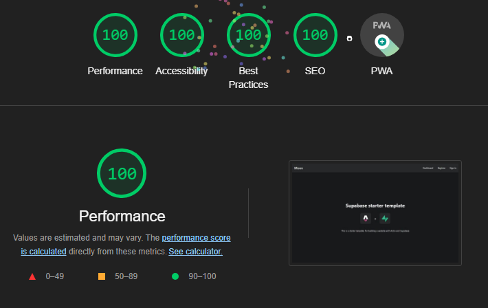

# Astro and Supabase auth demo

This is a demo of how to use [Astro](https://astro.build) and [Supabase](https://supabase.io) to create a simple authentication flow.

## Prerequisites

- A [Supabase](https://supabase.io) account. In the auth section of your Supabase project, you'll need to add redirect URLs for dev. You can read more in the [Supabase docs](https://supabase.com/docs/guides/auth/concepts/redirect-urls).

  For example, if you're running the dev server on port 4321, you'll need to add the following redirect URL:

  ```txt
  http://localhost:4321/**
  ```

- A [GitHub](https://github.com) OAuth app. You can create one in the GitHub developer settings under **OAuth Apps**. Follow the [Supabase docs](https://supabase.com/docs/guides/auth/social-login/auth-github) to add the GitHub OAuth app credentials to your Supabase project.

## Getting started

1. Create a `.env` file with the following variables:

   ```bash
   SUPABASE_URL=supabase_url
   SUPABASE_KEY=supabase_key
   ```

   _You can find these values in the **API Settings** section of your Supabase project._

2. Install dependencies:

   ```bash
   pnpm install
   ```

3. Run the dev server:

   ```bash
   pnpm dev
   ```


